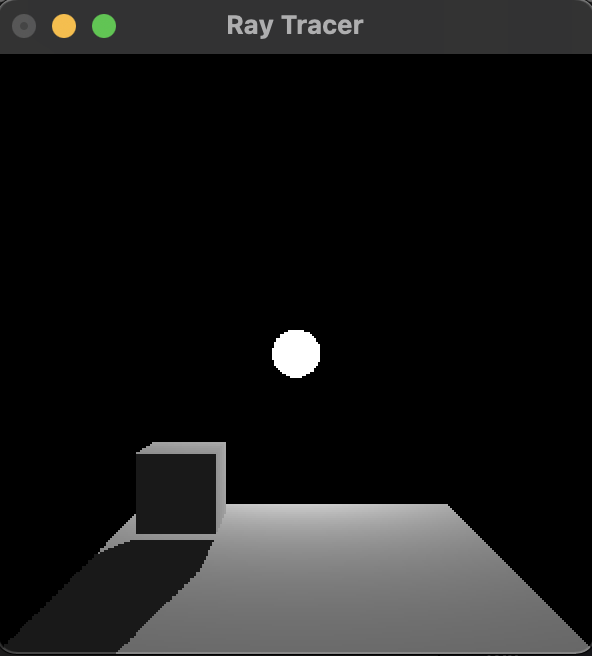

# c-ray-tracer

This project is a multithreaded ray tracer that currently supports rendering triangles and spheres. 

## How to Use

### macOS
Open the Xcode project file and just click Run.

### Linux
Execute `make` in the c-ray-tracer folder and then run the executable output.

  

  
  
Low Resolution Cube Example

